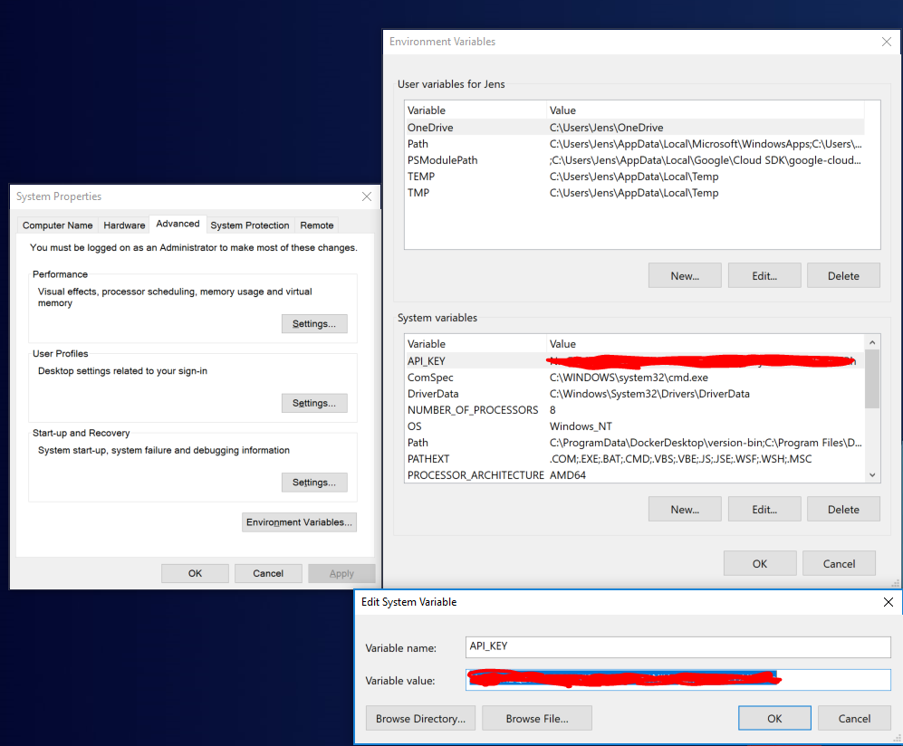
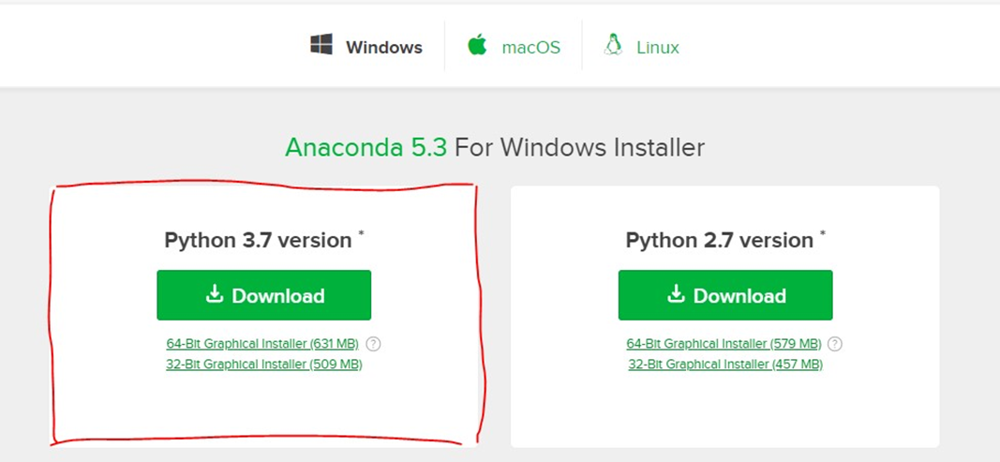
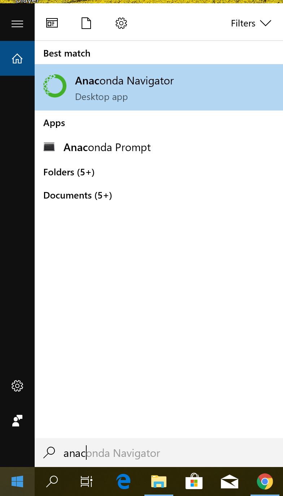
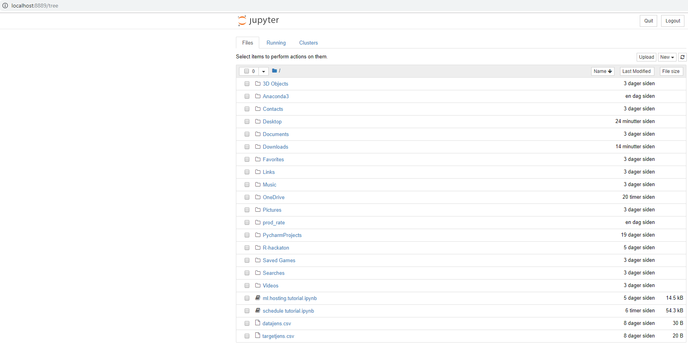

<a href="https://cognite.com/">
    
</a>

Getting started 
===========================

A description of the setups required for the Model Hosting tutorials or pattern search example, for Windows, Ubuntu and Mac.
Obtaining an API key and a project name from an administrator is a prerequisite for model hosting. 


### Windows

#### Set API key as environment variable

- Add the API key as an environment variable for security purposes. I named it "API_KEY" in the example below



#### Installation of Jupyter notebook through Anaconda
In order to start the tutorials you will need a programming environment. I will present how to use Jupyter Notebook through Anaconda, but feel free to use another programming environment. 
- Install Anaconda Python 3.7 version from the [Anaconda](https://www.anaconda.com/download/) website.



- Launch Anaconda Navigator



- Install Jupyter notebook
- Launch Jupyter notebook


- Follow the instructions:


- Create a new notebook from this page in your browser



- Install the Cognite SDK and other packages missing packages (e.g. matplotlib).
 The method below can be executed directly into the Jupyter notebook, and also work if the notebook is in a virtual environment. 
```
# Install a pip package in the current Jupyter kernel
import sys
!{sys.executable} -m pip install cognite-sdk
```

### Mac

#### Set API key as environment variable

Set your api key as environment variable: API_KEY

#### Set-up mac 
If you already have Python3 and pip installed, you can jump straight to the Python Libraries section. If you are unsure of the state of your environment, run the following commands to see how much setup you need to do.
1. Open Terminal ‑ you can do this by searching Terminal in Spotlight Search (Cmd+Space).


#### GCC

1.	Run: gcc
2.	If you see error: no input files , GCC is installed. Go to the next sec on.
3.	If instead you see command not found , you will need to install GCC ‑ there are multiple ways to do this, depending on your OSX version (this might require an Internet search). One possibility, if you have an Apple account, is to download the Command Line Tools [here](https://idmsa.apple.com/IDMSWebAuth/login?appIdKey=891bd3417a7776362562d2197f89480a8547b108fd934911bcbea0110d07f757&path=%2Fdownload%2Fmore%2F&rv=1).

#### Homebrew

1.	Run: brew -v
2.	If you see Homebrew x.x.x , Homebrew is installed. Go to the next sec on!
3.	If you don’t see this, you will need to install Homebrew. To do this, go to this [site](https://brew.sh/).
4.	Copy the first line under Install Homebrew . Paste it into Terminal, and hit Enter.
5.	Enter your password when prompted and wait for Homebrew to finish installing.
6.	If you now see Homebrew x.x.x when you run ```brew -v``` , go to the next sec on!
7.	If you don’t see this, you might need to add Homebrew to PATH. Run 
```
touch ~/.bash_profile; open ~/.bash_profile
```
8.	A text editor should pop up.
9.	Copy the following line to bottom of the file in the text editor: export
PATH=/usr/local/bin:/usr/local/sbin:$PATH

#### Python 3
1.	We will be using Python 3. To check which version of Python is installed on your machine, run: ```python3 --version``` , or ```python --version``` . If you see Python 3.x.x , Python 3 is installed. Go to the next sec on! If you see Python 2.x.x , you will need to install Python 3.
2.	To install Python 3, run ```brew install python``` . Brew installs Python 3 when this command is run.
3.	Run ```python3 --version``` . You should see something like Python 3.x.x .

#### Pip

1.	Run: ```pip3 --version``` , or ```pip --version```
2.	If you see pip xx.x from … (python 3.x) , pip is installed. Go to the next sec on!
3.	If you don’t see this, please reinstall Python 3 (using the instructions in the above sec on). Pip is automatically installed with newer versions of Python 3.

#### Python libraries

Several libraries might be relevant. To install them, you can use pip or pip3 , depending on which command is linked to your Python 3 installation. 
To check, run ```pip3 --version``` or ```pip --version``` . The command that outputs (python 3.x) is the command linked to Python 3.

Create a file called requirements.txt and copy the following text to it:
```
matplotlib
pandas 
numpy 
cufflinks
cognite-sdk 
plotly 
cython 
tslearn 
jupyter
"Insert other library you need" 
```

Then, navigate to the folder with this file on Terminal (if you are unfamiliar with navigating the Terminal, have a look at [these](http://mally.stanford.edu/~sr/computing/basic-unix.html commands!), and run the following command, using either pip or pip3:
```cat requirements.txt | xargs pip3 install --upgrade --force-reinstall --user```

The reason we need to run this command instead of ```pip3 install -r requirements.txt -U -user```, the usual command, is because the dependencies must be installed in a specified order and
updated to the latest versions.
Now, when you run jupyter notebook in Terminal a new page should open up on your Internet browser.
You’re all set! 

### Ubuntu

#### Set API key as environment variable

Set your api key as environment variable: API_KEY

#### Set-up Ubuntu
The following instructions will be used to install Python 3, Jupyter Notebook, and several Python
libraries.
1. Open Terminal.
2. Run ```python --version``` . If you do not see python 3.x.x , run ```python3 --version``` . If you
still do not see python 3.x.x , run ```sudo apt install python3```
3. Then, run ```pip3 --version``` . If pip is not installed, run ```sudo apt install python3-pip```
4. You will also need to install the IPython shell. To do this, run ```sudo apt install ipython3```
5. Now you’re ready to install Jupyter! Run ```pip3 install jupyter```
6. Once you have installed Jupyter, you will need to add it to the execution path. To do this,
open ```~./bashrc``` in your favourite text editor and add the following line to the bottom of the file: ```export PATH=$PATH:~/.local/bin/```
7. To confirm that Jupyter Notebook was installed properly, close and re‐open Terminal, then
run ```jupyter notebook``` . If a new tab opens in your browser, you’re all set! You can close
this tab and continue on to install some other Python libraries.

#### Python libraries

Several libraries might be useful for the Model Hosting tutorials and Pattern search example.
Create a file called requirements.txt and copy the following text to it:
```
matplotlib
pandas
numpy
cufflinks
cognite-sdk
plotly
cython
"Insert other library you need"
```
Then, navigate to the folder with this file on Terminal, and run the following command:

```pip3 install -r requirements.txt -U```

Then, we will have to install one more library (this library has a dependency on cython which
was installed above):

```pip3 install tslearn```

You’re all set! 
